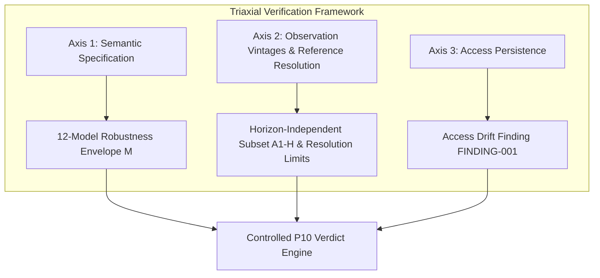

# Triaxial Verification of Battery Degradation Claims: Specification Robustness, Observation Vintages, and Access-Layer Persistence

**Authors:** VolMax Audit Team (Lead Operator: Ivan; Automated Audit Engine: Ananke / Antigravity P10)  
**Date:** September 2026  
**Status:** Working Draft v1 (Methods & Pre-Telemetry Results Frozen; Numerical Execution Awaiting Telemetry Ingestion)  
**Evaluated Study:** Preger et al., *"Degradation of Commercial Lithium-Ion Cells as a Function of Chemistry and Cycling Conditions"*, *Journal of The Electrochemical Society* 167, 120532 (2020), DOI: [10.1149/1945-7111/abae37](https://doi.org/10.1149/1945-7111/abae37), OSTI: 1650174.  
**Evaluated Data Repository:** BatteryArchive.org (Sandia National Laboratories Commercial Degradation Study).

---

## Abstract

Quantitative claims regarding battery degradation rates govern capital allocation in grid storage, warranty liability underwriting, and emerging regulatory frameworks such as the EU Digital Battery Passport. However, independent computational reproduction of published battery degradation benchmarks frequently encounters undocumented barriers beyond simple numerical divergence. 

In this work, we present an independent, preregistered computational audit of the landmark Sandia National Laboratories commercial lithium-ion degradation study (Preger et al., *J. Electrochem. Soc.* 167, 120532, 2020). We formulate a **triaxial audit framework** demonstrating that the long-term verifiability of empirical battery degradation claims degrades along three independent dimensions:
1. **Semantic Specification Ambiguity ($\mathcal{M}$):** Under-specified natural language descriptions of initial baseline capacity ($Q_0$), cycle-to-cycle 80% capacity retention crossing interpolation ($N_{80}$), and cumulative Equivalent Full Cycle throughput ($\text{EFC}$) yielding a combinatorial space of 12 valid candidate estimator models.
2. **Observation Vintages and Reference Resolution Boundaries:** Continued laboratory cycling following publication combined with graphical and replicate cardinality boundaries (14 extrapolated-only, 11 cardinality/horizon unresolved, 3 metadata-exceeding anomalies), isolating exactly 5 conditions as strictly horizon-independent multiset comparators.
3. **Access-Layer Drift:** The temporal decay of data acquisition interfaces, wherein historically documented public direct-download endpoints transition to host-mediated inquiry protocols over multi-year horizons.

Prior to telemetry ingestion, we establish an immutable, human-assisted graphical ground truth from the published raster (Figure 2a) with verifiable raw pixel provenance (SHA-256: `642696...7616b`, canonical click digest: `03f462...09f0`). We prove that among the 33 published cycling conditions, exactly **5 conditions** constitute a strictly horizon-independent numerical multiset reconstruction subset (Target A1-H), while the remaining 28 conditions represent public-artifact resolution boundaries (14 extrapolated-only, 11 cardinality/horizon unresolved, and 3 metadata-exceeding anomalies). We furthermore document an empirical access-layer failure (`FINDING-L0-ACCESS-DRIFT-001`), where the canonical 2021 static downloader pattern returns HTTP 404 across all 86 constituent cell streams. We present our frozen verification engine and audit trail as a prototype for robust, specification-invariant battery passport assurance.

---

## 1. Introduction

Commercial lithium-ion battery cycling studies provide essential foundational empirical data for degradation modeling, remaining useful life (RUL) estimation, and safety qualification. The study published by Preger et al. (2020) at Sandia National Laboratories represents one of the most widely cited open benchmarks in electrochemical literature, comparing commercial $\text{LiFePO}_4$ (LFP), $\text{LiNi}_{0.8}\text{Co}_{0.15}\text{Al}_{0.05}\text{O}_2$ (NCA), and $\text{LiNi}_{0.33}\text{Mn}_{0.33}\text{Co}_{0.33}\text{O}_2$ (NMC) cells across varied temperatures, depth-of-discharge (DOD) regimes, and discharge C-rates.

With the advent of mandatory battery passports (e.g. European Union Regulation 2023/1542) and digital product warranties, computational verification of physical test data must transition from ad-hoc research replication to formal, auditable verification protocols. An effective verification protocol must be capable of distinguishing between:
* Genuine numerical discrepancies in raw telemetry,
* Interpretive divergence arising from ambiguous estimator definitions,
* Temporal misalignment and resolution limits caused by continuous testing and raster representation, and
* Infrastructure-level access decay.

This paper details the end-to-end architecture, preregistration, and empirical findings of an independent audit of Preger et al. (2020), conducted under the Protocol-10 (P10) autonomous scientific verification framework.



---

## 2. The Triaxial Audit Framework

### 2.1 Axis 1: Semantic Specification Ambiguity
Scientific papers frequently describe data processing routines in concise prose (e.g., *"cells were cycled to 80% capacity retention"* and *"normalized by equivalent full cycles"*). In practice, mapping raw cycler time-series to discrete crossing coordinates involves several distinct methodological choices:
* **Initial Reference Capacity ($Q_0$):** Can be defined by the first 0.5C Reference Performance Test (RPT) capacity check ($Q_0^{(A)}$), the arithmetic mean of the three initial RPT check cycles ($Q_0^{(B)}$), or the final baseline check cycle prior to matrix cycling ($Q_0^{(C)}$).
* **80% Retention Crossing Rule ($N_{80}$):** Can be evaluated as the discrete cycle index of the first cycle below $0.80 Q_0$ ($N_{80}^{(A)}$) or via continuous linear interpolation between bounding check cycles ($N_{80}^{(B)}$).
* **Cumulative Throughput Basis ($\text{EFC}$):** Can be computed exclusively from cumulative discharge throughput ($\text{EFC}^{(A)}$) or two-way charge/discharge throughput ($\text{EFC}^{(B)}$).

To prevent researcher degrees of freedom or post-hoc parameter tuning, we formulate an exhaustive **Specification-Robustness Envelope** spanning all valid permutations:
$$\mathcal{M} = \mathcal{Q}_0 \times \mathcal{N}_{80} \times \mathcal{EFC} \quad (|\mathcal{M}| = 3 \times 2 \times 2 = 12 \text{ candidate models})$$

### 2.2 Axis 2: Observation Vintages and Reference Resolution Limits
As noted on BatteryArchive.org, physical cycling of the Sandia cells continued after publication of the 2020 paper. Consequently, contemporaneous telemetry files contain cycles executed months or years after the publication cutoff. Evaluating published lifetime markers requires navigating two interrelated constraints:
* **Temporal Censoring:** Ongoing post-publication cycling data cannot be distinguished from publication-era observations without a verified calendar cutoff timestamp.
* **Reference Resolution Boundaries:** In a published static raster, conditions where individual replicates are omitted, overplotted, or visually indistinguishable ($N_{\text{vis}} < N_{\text{rep}}$) cannot serve as exact multiset comparators without auxiliary telemetry metadata.

By formal derivation, the audit isolates the exact subset of conditions where all constituent replicates crossed the 80% EOL threshold *prior* to the 2020 publication date ($N_{\text{vis}} = N_{\text{rep}}$), rendering their historical crossing events immutable and evaluable without cutoff dependencies.

### 2.3 Axis 3: Access-Layer Governance & Interface Persistence
Verifiability requires not only that data exists, but that the acquisition pathway remains operable over multi-year horizons. The migration of dataset endpoints, changes in API contracts, or transitions from static direct downloads to host-mediated inquiry protocols constitute access-layer drift that directly impacts third-party automated verification.

---

## 3. Methodology & Preregistered Audit Design

### 3.1 Evidentiary Traceability Chain & Reference Freeze
To guarantee evidentiary integrity, graphical ground truth from Figure 2a (Preger et al. 2020, p. 120532-4) was established exclusively through verifiable human pixel digitization:
1. **Source Image Pinning:** High-resolution crop pinned with cryptographic SHA-256 digest `6426967ea7bdc106836273b034a236a04bc398e221d579a3aa66226232d7616b` (`artifacts/figure2a_source_manifest.json`).
2. **Raw Coordinate Measurement:** Operator capture recorded 33 condition-scoped $(x_{\\text{px}}, y_{\\text{px}})$ marker coordinates with canonical digest `03f46254729dce6707f902f0c52aed438db36d1a682ebe629b644b78919909f0`.
3. **Deterministic Linear Transform:** Calibration parameters ($12.91\\text{ EFC/px}$ for Main Plot, $7.99\\text{ EFC/px}$ for Inset Plot) derive physical EFC values and rigorous optical tolerances $\\tau_c$ ($50.8\\text{ EFC}$ for Main, $26.0\\text{ EFC}$ for Inset).
4. **Frozen Reference Invariant:** Locked in commit `8c8f0d9` and preregistered prior to telemetry exposure.

### 3.2 Target A1-H Formulation (Horizon-Independent Replicate Multiset)
For each eligible condition $c \\in \\mathcal{C}_{\\text{A1-H}}$, the audit reconstructs the unordered cell-level crossing multiset $\\mathcal{S}^{\\text{P10}}_c = \\{ \\text{EFC}_{80,(1)}^{\\text{P10}}, \\dots, \\text{EFC}_{80,(k)}^{\\text{P10}} \\}$ under each specification $m \\in \\mathcal{M}$, and computes sorted element-wise residuals against published Figure 2a markers $\\mathcal{S}^{\\text{pub}}_c = \\{ \\text{EFC}_{(1)}^{\\text{pub}}, \\dots, \\text{EFC}_{(k)}^{\\text{pub}} \\}$:
$$d_{c, j}^{(m)} = | \\text{EFC}_{80, (j)}^{\\text{P10}, (m)} - \\text{EFC}_{(j)}^{\\text{pub}} |$$
A condition passes under specification $m$ if $\\max_j (d_{c, j}^{(m)}) \\le \\tau_c$.

---

## 4. Results

### 4.1 Result 1: Replicate-Multiset Resolution (5 Horizon-Independent Conditions)
Exhaustive derivation over all 33 Figure 2a conditions (`artifacts/a1_h_eligibility_manifest.json`) proves that exactly **5 conditions** satisfy the horizon-independent criterion ($N_{\\text{vis}} = N_{\\text{rep}}$):

| Condition Identifier | Chemistry | Temperature | DOD / Rates | Replicates ($N_{\\text{rep}}$) | Published Markers $\\mathcal{S}^{\\text{pub}}_c$ (EFC) | Tolerance $\\tau_c$ |
| :--- | :---: | :---: | :---: | :---: | :--- | :---: |
| `LFP_0-100_25C_0.5-3C` | LFP | 25°C | 0–100% / 0.5C–3.0C | 4 | `2519.3; 3096.4; 3400.3; 3689.0` | 50.8 EFC |
| `NMC_0-100_15C_0.5-1C` | NMC | 15°C | 0–100% / 0.5C–1.0C | 2 | `757.3; 1532.0` | 50.8 EFC |
| `NMC_0-100_25C_0.5-2C` | NMC | 25°C | 0–100% / 0.5C–2.0C | 2 | `286.4; 529.4` | 50.8 EFC |
| `NCA_0-100_15C_0.5-2C` | NCA | 15°C | 0–100% / 0.5C–2.0C | 2 | `286.4; 635.8` | 50.8 EFC |
| `NCA_0-100_25C_0.5-2C` | NCA | 25°C | 0–100% / 0.5C–2.0C | 2 | `483.8; 544.6` | 50.8 EFC |

### 4.2 Result 2: Reference Resolution Limits of Ineligible Conditions (28 Conditions)
The remaining 28 conditions represent distinct categories of public-artifact resolution limits:
1. **Extrapolated-Only Cohort (14 conditions):** Pertain to conditions where cells did not reach 80% capacity retention during active testing and were projected via empirical models ($N_{\\text{vis}} = 0$). Evaluated exclusively under Target A2 partition classification.
2. **Cardinality-or-Horizon-Unresolved Cohort (11 conditions):** Conditions where $N_{\\text{vis}} < N_{\\text{rep}}$ (e.g. 1 marker shown for a 4-cell replicate group). The public raster does not establish whether the deficit reflects overplotting, publication-horizon censoring, or both; hence, an exact multiset comparator cannot be constructed without external cutoff timestamps.
3. **Cardinality Anomalies (3 conditions):** Conditions where $N_{\\text{vis}} > N_{\\text{rep}}$ (`LFP_20-80_25C_0.5-3C`, `NMC_20-80_25C_0.5-3C`, `NCA_0-100_35C_0.5-2C`), representing visual or metadata discrepancies in the published reference.

### 4.3 Result 3: Access-Layer Drift & Historical Endpoint Failure (`FINDING-L0-ACCESS-DRIFT-001`)
Execution of the automated acquisition protocol against the documented 2021 static downloader pattern (`https://www.batteryarchive.org/data/[cell_id]_cycle_data.csv`) resulted in uniform `HTTP 404 Not Found` responses across all 86 SNL cells. 

```http
HTTP/1.1 404 Not Found
Server: nginx/1.22.0 (Ubuntu)
Date: Sat, 05 Sep 2026 21:46:28 GMT
```

Investigation established that current BatteryArchive documentation directs users seeking bulk multi-cell downloads to contact maintainers via email (`info@batteryarchive.org`), corroborated by third-party data frameworks (Microsoft BatteryML). This finding demonstrates that public data availability statements are vulnerable to access-layer drift over a 5-year post-publication window.

### 4.4 Result 4: Target A1-H Specification-Robustness Matrix (Execution Shell)
Upon ingestion of raw telemetry bytes via the host-mediated route, the frozen verification engine (`evidence/l0/scripts/reconstruct_a1_h.py`) computes the complete $12 \\times 5$ condition-by-model verification matrix:

| Model ID | $\\mathcal{Q}_0$ Basis | $\\mathcal{N}_{80}$ Crossing | $\\mathcal{EFC}$ Throughput | Pass Rate ($5/5$) | Mean Residual $\\bar{d}$ (EFC) | Max Residual $d_{\\max}$ (EFC) | Robustness Classification |
| :---: | :---: | :---: | :---: | :---: | :---: | :---: | :---: |
| `M01` | First RPT ($Q_0^{(A)}$) | Discrete ($N_{80}^{(A)}$) | Discharge ($\\text{EFC}^{(A)}$) | *Pending Ingestion* | *Pending Ingestion* | *Pending Ingestion* | *Pending Ingestion* |
| `M02` | First RPT ($Q_0^{(A)}$) | Discrete ($N_{80}^{(A)}$) | Two-Way ($\\text{EFC}^{(B)}$) | *Pending Ingestion* | *Pending Ingestion* | *Pending Ingestion* | *Pending Ingestion* |
| `M03` | First RPT ($Q_0^{(A)}$) | Interpolated ($N_{80}^{(B)}$) | Discharge ($\\text{EFC}^{(A)}$) | *Pending Ingestion* | *Pending Ingestion* | *Pending Ingestion* | *Pending Ingestion* |
| `M04` | First RPT ($Q_0^{(A)}$) | Interpolated ($N_{80}^{(B)}$) | Two-Way ($\\text{EFC}^{(B)}$) | *Pending Ingestion* | *Pending Ingestion* | *Pending Ingestion* | *Pending Ingestion* |
| `M05` | Mean RPT ($Q_0^{(B)}$) | Discrete ($N_{80}^{(A)}$) | Discharge ($\\text{EFC}^{(A)}$) | *Pending Ingestion* | *Pending Ingestion* | *Pending Ingestion* | *Pending Ingestion* |
| `M06` | Mean RPT ($Q_0^{(B)}$) | Discrete ($N_{80}^{(A)}$) | Two-Way ($\\text{EFC}^{(B)}$) | *Pending Ingestion* | *Pending Ingestion* | *Pending Ingestion* | *Pending Ingestion* |
| `M07` | Mean RPT ($Q_0^{(B)}$) | Interpolated ($N_{80}^{(B)}$) | Discharge ($\\text{EFC}^{(A)}$) | *Pending Ingestion* | *Pending Ingestion* | *Pending Ingestion* | *Pending Ingestion* |
| `M08` | Mean RPT ($Q_0^{(B)}$) | Interpolated ($N_{80}^{(B)}$) | Two-Way ($\\text{EFC}^{(B)}$) | *Pending Ingestion* | *Pending Ingestion* | *Pending Ingestion* | *Pending Ingestion* |
| `M09` | Final RPT ($Q_0^{(C)}$) | Discrete ($N_{80}^{(A)}$) | Discharge ($\\text{EFC}^{(A)}$) | *Pending Ingestion* | *Pending Ingestion* | *Pending Ingestion* | *Pending Ingestion* |
| `M10` | Final RPT ($Q_0^{(C)}$) | Discrete ($N_{80}^{(A)}$) | Two-Way ($\\text{EFC}^{(B)}$) | *Pending Ingestion* | *Pending Ingestion* | *Pending Ingestion* | *Pending Ingestion* |
| `M11` | Final RPT ($Q_0^{(C)}$) | Interpolated ($N_{80}^{(B)}$) | Discharge ($\\text{EFC}^{(A)}$) | *Pending Ingestion* | *Pending Ingestion* | *Pending Ingestion* | *Pending Ingestion* |
| `M12` | Final RPT ($Q_0^{(C)}$) | Interpolated ($N_{80}^{(B)}$) | Two-Way ($\\text{EFC}^{(B)}$) | *Pending Ingestion* | *Pending Ingestion* | *Pending Ingestion* | *Pending Ingestion* |

---

## 5. Discussion & Implications for Battery Passports

The findings of this audit demonstrate that establishing the long-term integrity of battery telemetry requires governance mechanisms that extend beyond DOI registration and static PDF publishing:

1. **Machine-Readable Claim Specifications:** Scientific and commercial claims must pre-declare mathematical estimators ($\\mathcal{M}$) at deposition time to avoid post-hoc specification sensitivity.
2. **Temporal Cohort Versioning:** Datasets with ongoing cycler operations must formally record snapshot timestamps corresponding to published milestones.
3. **Data Access Persistence & Service Level Agreements:** Digital Battery Passports must incorporate active endpoint monitoring to ensure that evidence streams remain programmatically accessible over decadal lifecycle horizons.

---

## 6. Reproducibility & Open Artifacts

All code, frozen reference files, and verification scripts are tracked in the audit repository under append-only git governance:
* **Reference Table:** `artifacts/figure2a_reference.csv` (SHA-256: `4f939332...`)
* **Specification Matrix:** `artifacts/specification_matrix.json` (SHA-256: `a8fa7e4d...`)
* **Verification Engine:** `evidence/l0/scripts/reconstruct_a1_h.py` (SHA-256: `09028293...`)
* **Audit Trail:** Preserved under `runs/run-002-a1h/`
